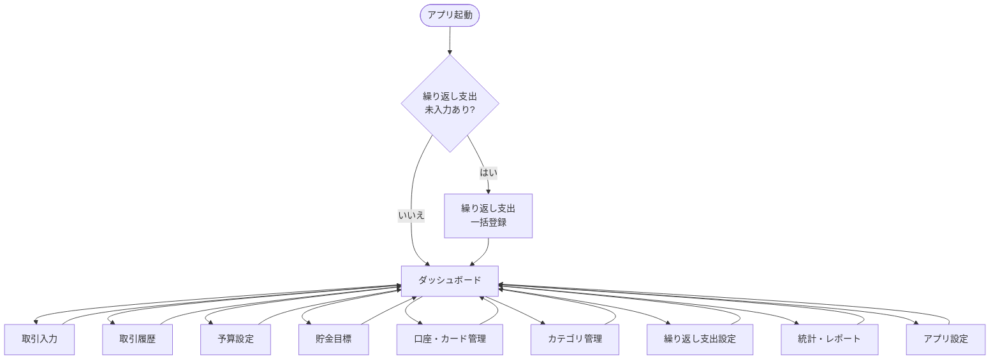

# FLOWLET 画面設計書

## 1. 概要

本ドキュメントはFLOWLETアプリケーションの画面設計を定義します。

### 設計方針
- **レスポンシブデザイン**: PC版とスマホ版に最適化
- **ナビゲーション**: 
  - PC: サイドバーメニュー(固定)
  - スマホ: ハンバーガーメニュー
- **カラースキーム**: 
  - プライマリ: #4ECDC4 (ターコイズ)
  - セカンダリ: #FFE66D (イエロー)
  - 成功: #95E1D3 (ライトグリーン)
  - 警告: #FF6B6B (レッド)
- **UI原則**: シンプル、直感的、視覚的フィードバック

---

## 2. 画面一覧

| No | 画面名 | 説明 | 優先度 |
|----|--------|------|--------|
| 1 | ダッシュボード | ホーム画面、収支サマリー表示 | 高 |
| 2 | 取引入力 | 収入/支出/口座間移動の登録 | 高 |
| 3 | 取引履歴 | 過去の取引を確認・編集・削除 | 高 |
| 4 | 予算設定 | サイクル別・カテゴリ別予算管理 | 中 |
| 5 | 口座・カード管理 | 口座とクレジットカードの管理 | 中 |
| 6 | 貯金目標 | 目的別貯金の目標設定と進捗管理 | 中 |
| 7 | カテゴリ管理 | 収入・支出カテゴリの階層管理 | 低 |
| 8 | 繰り返し支出設定 | 定期的な支出の登録と一括入力 | 低 |
| 9 | 統計・レポート | 収支の分析とグラフ表示 | 低 |
| 10 | アプリ設定 | 給料日設定などの基本設定 | 低 |

---

## 3. 画面遷移図



---

## 4. 共通UI要素

### 4.1 ヘッダー
**PC版:**
```
┌─────────────────────────────────────────────┐
│ FLOWLET          [ユーザー名] [設定] [⚙]   │
└─────────────────────────────────────────────┘
```

**スマホ版:**
```
┌─────────────────────────┐
│ ☰  FLOWLET      [⚙]    │
└─────────────────────────┘
```

### 4.2 サイドバーメニュー(PC版)
```
🏠 ホーム
💰 取引
  - 入力
  - 履歴
📊 予算
🎯 貯金
🏦 口座・カード
📁 カテゴリ
🔄 繰り返し支出
📈 レポート
⚙ 設定
```

### 4.3 プログレスバー
- 0-60%: 緑色
- 60-80%: 黄色
- 80-99%: オレンジ色
- 100%以上: 赤色

### 4.4 カード
- 白背景
- 角丸(8px)
- シャドウ(軽め)
- パディング: 16px

### 4.5 ボタン
- プライマリボタン: ターコイズ背景
- セカンダリボタン: グレー背景
- 削除ボタン: 赤色背景

---

## 5. 各画面の詳細設計

### 5.1 ダッシュボード

**目的:** アプリ起動時の最初の画面。収支状況を一目で確認

**主要機能:**
- 今サイクルの収支サマリー
- 予算使用状況
- 口座残高一覧
- カード利用状況
- 貯金目標進捗
- グラフ表示(サイクル別推移、カテゴリ別円グラフ)

**API:**
- `GET /api/reports/dashboard`

**詳細:** 別ドキュメント「FLOWLET ダッシュボード画面 ワイヤーフレーム」参照

---

### 5.2 取引入力

**目的:** 収入・支出・口座間移動を登録

**主要機能:**
- 取引タイプ選択(収入/支出/口座間移動)
- 日付、金額、カテゴリ入力
- 支払方法選択(口座/カード)
- 貯金目標への割り当て(口座間移動時)

**API:**
- `POST /api/transactions`
- `GET /api/categories`
- `GET /api/accounts`
- `GET /api/credit-cards`
- `GET /api/savings-goals`

**バリデーション:**
- 日付: 必須
- 金額: 必須、0より大きい
- カテゴリ: 必須(口座間移動以外)
- 貯金割り当て: 合計が移動額と一致

**詳細:** 別ドキュメント「FLOWLET 取引入力画面 ワイヤーフレーム」参照

---

### 5.3 取引履歴

**目的:** 過去の取引を確認・編集・削除

**主要機能:**
- フィルター機能(期間、タイプ、カテゴリ、口座、カード、キーワード)
- 集計表示(収入・支出・収支)
- ページネーション
- 取引詳細表示
- 編集・削除

**API:**
- `GET /api/transactions`
- `GET /api/transactions/{transactionId}`
- `PUT /api/transactions/{transactionId}`
- `DELETE /api/transactions/{transactionId}`

**詳細:** 別ドキュメント「FLOWLET 取引履歴画面 ワイヤーフレーム」参照

---

### 5.4 予算設定

**目的:** サイクル別・カテゴリ別の予算を管理

**主要機能:**
- サイクル選択(前後移動)
- 全体予算設定
- カテゴリ別予算設定(大・小)
- 使用状況表示(金額、残額、使用率)

**API:**
- `GET /api/budgets`
- `GET /api/budgets/current`
- `POST /api/budgets`
- `PUT /api/budgets/{budgetId}`
- `DELETE /api/budgets/{budgetId}`

**バリデーション:**
- 予算額: 必須、0より大きい
- 小カテゴリ合計 = 大カテゴリ予算

**詳細:** 別ドキュメント「FLOWLET 予算設定画面 ワイヤーフレーム」参照

---

### 5.5 口座・カード管理

**目的:** 口座とクレジットカードの情報を管理

**主要機能:**
- タブ切り替え(口座/カード)
- 口座一覧表示(残高、貯金目標内訳)
- カード一覧表示(利用状況、引き落とし情報、不足額)
- CRUD操作

**API:**
- `GET /api/accounts`
- `POST /api/accounts`
- `PUT /api/accounts/{accountId}`
- `DELETE /api/accounts/{accountId}`
- `GET /api/credit-cards`
- `GET /api/credit-cards/{creditCardId}/usage`
- `POST /api/credit-cards`
- `PUT /api/credit-cards/{creditCardId}`
- `DELETE /api/credit-cards/{creditCardId}`

**詳細:** 別ドキュメント「FLOWLET 口座・カード管理画面 ワイヤーフレーム」参照

---

### 5.6 貯金目標

**目的:** 目的別貯金の目標を設定し進捗を管理

**主要機能:**
- 貯金用口座サマリー(総残高、割当額、未割当額)
- 目標一覧表示(達成率)
- 目標の作成・編集・削除
- 目標額あり/なしの設定

**API:**
- `GET /api/savings-goals`
- `GET /api/savings-goals/summary`
- `POST /api/savings-goals`
- `PUT /api/savings-goals/{savingsGoalId}`
- `DELETE /api/savings-goals/{savingsGoalId}`

**バリデーション:**
- 目標名: 必須
- 貯金用口座: 必須
- 目標額: 任意(退避用の場合はnull)
- 削除: 現在額が0の場合のみ可能

**詳細:** 別ドキュメント「FLOWLET 貯金目標画面 ワイヤーフレーム」参照

---

### 5.7 カテゴリ管理

**目的:** 収入・支出のカテゴリを階層的に管理

**主要機能:**
- タブ切り替え(支出/収入)
- 階層表示(大カテゴリ→小カテゴリ)
- 展開/折りたたみ
- カテゴリの作成・編集・削除(論理削除)
- 削除済みカテゴリの復元

**API:**
- `GET /api/categories`
- `POST /api/categories`
- `PUT /api/categories/{categoryId}`
- `DELETE /api/categories/{categoryId}`

**詳細:** 別ドキュメント「FLOWLET カテゴリ管理画面 ワイヤーフレーム」参照

---

### 5.8 繰り返し支出設定

**目的:** 定期的な支出を登録し、一括入力を支援

**主要機能:**
- 繰り返し支出一覧表示
- 次回支払予定日の表示
- CRUD操作
- 未入力の繰り返し支出一括登録(起動時ダイアログ)

**API:**
- `GET /api/recurring-expenses`
- `GET /api/recurring-expenses/pending`
- `POST /api/recurring-expenses`
- `POST /api/recurring-expenses/apply`
- `PUT /api/recurring-expenses/{recurringExpenseId}`
- `DELETE /api/recurring-expenses/{recurringExpenseId}`

**詳細:** 別ドキュメント「FLOWLET 繰り返し支出設定画面 ワイヤーフレーム」参照

---

### 5.9 統計・レポート

**目的:** 収支を分析し、グラフで可視化

**主要機能:**
- タブ切り替え(サイクル別推移/前期間比較/年間サマリー/カテゴリ別推移)
- グラフ表示(折れ線、円グラフ)
- 期間選択
- カテゴリ選択

**API:**
- `GET /api/reports/cycle-summary`
- `GET /api/reports/comparison`
- `GET /api/reports/annual-summary`
- `GET /api/reports/category-trend`
- `GET /api/reports/category-breakdown`

**詳細:** 別ドキュメント「FLOWLET 統計・レポート画面 ワイヤーフレーム」参照

---

### 5.10 アプリ設定

**目的:** 給料日などの基本設定を管理

**主要機能:**
- 給料日設定
- サイクル情報表示
- データ管理情報
- アプリ情報

**API:**
- `GET /api/app-settings`
- `PUT /api/app-settings`
- `GET /api/cycles/current`

**詳細:** 別ドキュメント「FLOWLET アプリ設定画面 ワイヤーフレーム」参照

---

## 6. インタラクション設計

### 6.1 フォーム入力
- リアルタイムバリデーション
- エラーは入力欄の下に赤文字で表示
- 必須項目は送信時に赤枠でハイライト

### 6.2 削除確認
- すべての削除操作で確認ダイアログを表示
- 「本当に削除しますか?」メッセージ
- [キャンセル] [削除] ボタン

### 6.3 モーダル
- PC版: 画面中央にオーバーレイ表示
- スマホ版: 全画面または下からスライドイン
- 背景クリックまたは[×]ボタンで閉じる

### 6.4 ページネーション
- PC版: 従来型(前へ/次へ、ページ番号)
- スマホ版: 無限スクロールまたは[もっと見る]ボタン

### 6.5 ローディング
- データ取得中はスピナー表示
- 長時間かかる場合はプログレスバー

### 6.6 成功/エラー通知
- 成功: 緑色のトースト通知(3秒で自動消去)
- エラー: 赤色のトースト通知(手動で閉じる)

---

## 7. レスポンシブデザイン

### 7.1 ブレークポイント
- モバイル: 〜768px
- タブレット: 769px〜1024px
- PC: 1025px〜

### 7.2 レイアウト変更
**PC:**
- サイドバー固定
- 2〜3カラムレイアウト
- ホバーエフェクト

**スマホ:**
- ハンバーガーメニュー
- 1カラムレイアウト
- タップエフェクト
- フローティングアクションボタン

---

## 8. アクセシビリティ

### 8.1 キーボード操作
- Tab/Shift+Tabでフォーカス移動
- Enter/Spaceで選択
- Escでモーダルを閉じる

### 8.2 色のコントラスト
- WCAG AA準拠
- テキストと背景のコントラスト比 4.5:1以上

### 8.3 フォントサイズ
- 本文: 16px以上
- ヘッダー: 24px以上

---

## 9. パフォーマンス

### 9.1 ページロード
- 初回ロード: 3秒以内
- ページ遷移: 1秒以内

### 9.2 画像最適化
- WebP形式使用
- 遅延読み込み

### 9.3 キャッシュ
- APIレスポンスのキャッシュ
- 静的リソースのブラウザキャッシュ

---

## 10. 今後の拡張機能

### 10.1 テーマ設定
- ライトモード/ダークモード切り替え

### 10.2 通知機能
- 予算超過時の通知
- 繰り返し支出の通知

### 10.3 データエクスポート/インポート
- CSV形式でのエクスポート
- バックアップ/リストア機能

---

## 11. 変更履歴

| 日付 | バージョン | 変更内容 |
|------|-----------|---------|
| 2025-01-26 | 1.0 | 初版作成 |

---

## 12. 参照ドキュメント

- FLOWLET 要件定義書
- FLOWLET データベース設計書
- FLOWLET API設計書
- 各画面のワイヤーフレーム(別ドキュメント)