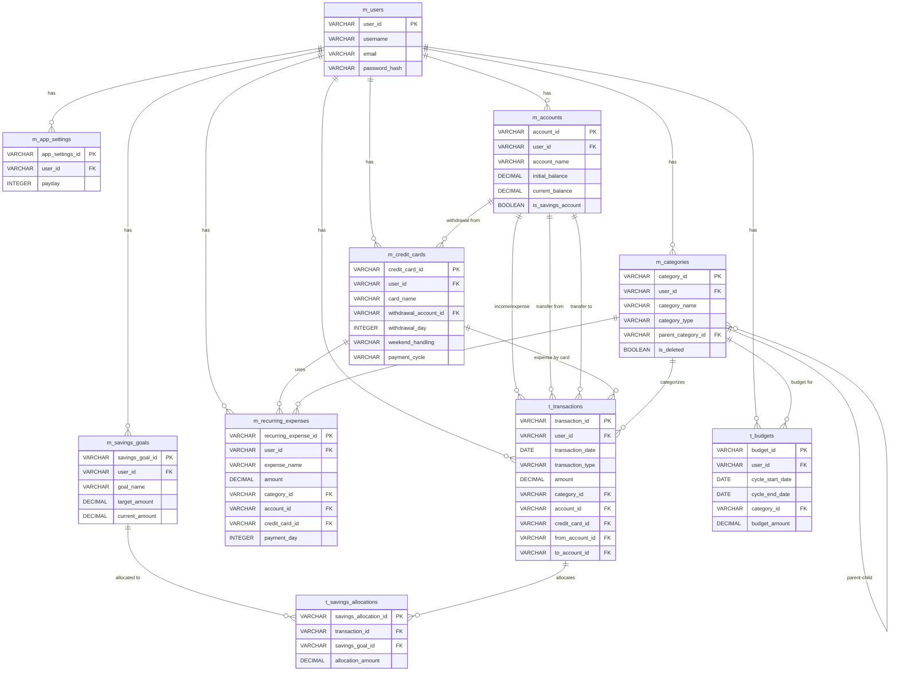

# FLOWLET データベース設計書

## 1. 概要

本ドキュメントはFLOWLETアプリケーションのデータベース設計を定義します。

### 設計方針
- スキーマ名: `flowlet`
- ID形式: プレフィックス(3文字) + 7桁数字(例: ACC0000001)
- マスタテーブル: `m_` プレフィックス
- トランザクションテーブル: `t_` プレフィックス
- 全テーブル共通カラム: created_by, created_at, updated_by, updated_at

---

## 2. テーブル一覧

### マスタテーブル
| No | テーブル名 | 論理名 | プレフィックス |
|----|-----------|--------|---------------|
| 1 | flowlet.m_app_settings | アプリ設定 | SET |
| 2 | flowlet.m_users | ユーザー | USR |
| 3 | flowlet.m_accounts | 口座 | ACC |
| 4 | flowlet.m_credit_cards | クレジットカード | CRD |
| 5 | flowlet.m_categories | カテゴリ | CAT |
| 6 | flowlet.m_savings_goals | 貯金目標 | SVG |
| 7 | flowlet.m_recurring_expenses | 繰り返し支出設定 | REC |

### トランザクションテーブル
| No | テーブル名 | 論理名 | プレフィックス |
|----|-----------|--------|---------------|
| 8 | flowlet.t_transactions | 取引記録 | TRX |
| 9 | flowlet.t_budgets | 予算設定 | BDG |
| 10 | flowlet.t_savings_allocations | 貯金割り当て | SAL |

---

## 3. スキーマ・Sequence作成

```sql
-- スキーマ作成
CREATE SCHEMA IF NOT EXISTS flowlet;

-- マスタテーブル用Sequence
CREATE SEQUENCE flowlet.seq_m_app_settings START 1 INCREMENT 1;
CREATE SEQUENCE flowlet.seq_m_users START 1 INCREMENT 1;
CREATE SEQUENCE flowlet.seq_m_accounts START 1 INCREMENT 1;
CREATE SEQUENCE flowlet.seq_m_credit_cards START 1 INCREMENT 1;
CREATE SEQUENCE flowlet.seq_m_categories START 1 INCREMENT 1;
CREATE SEQUENCE flowlet.seq_m_savings_goals START 1 INCREMENT 1;
CREATE SEQUENCE flowlet.seq_m_recurring_expenses START 1 INCREMENT 1;

-- トランザクションテーブル用Sequence
CREATE SEQUENCE flowlet.seq_t_transactions START 1 INCREMENT 1;
CREATE SEQUENCE flowlet.seq_t_budgets START 1 INCREMENT 1;
CREATE SEQUENCE flowlet.seq_t_savings_allocations START 1 INCREMENT 1;
```

---

## 4. テーブル定義

### 4.1 flowlet.m_app_settings (アプリ設定)

**概要:** アプリケーション全体の設定を管理

```sql
CREATE TABLE flowlet.m_app_settings (
    app_settings_id VARCHAR(10) PRIMARY KEY DEFAULT ('SET' || LPAD(NEXTVAL('flowlet.seq_m_app_settings')::TEXT, 7, '0')),
    user_id VARCHAR(10),
    payday INTEGER NOT NULL CHECK (payday BETWEEN 1 AND 31),
    created_by VARCHAR(10),
    created_at TIMESTAMP NOT NULL DEFAULT CURRENT_TIMESTAMP,
    updated_by VARCHAR(10),
    updated_at TIMESTAMP NOT NULL DEFAULT CURRENT_TIMESTAMP
);

COMMENT ON TABLE flowlet.m_app_settings IS 'アプリ設定';
COMMENT ON COLUMN flowlet.m_app_settings.app_settings_id IS '設定ID';
COMMENT ON COLUMN flowlet.m_app_settings.user_id IS 'ユーザーID';
COMMENT ON COLUMN flowlet.m_app_settings.payday IS '給料日(1-31、土日祝は前営業日に自動調整)';
```

---

### 4.2 flowlet.m_users (ユーザー) ※認証機能実装時

**概要:** ユーザー情報を管理

```sql
CREATE TABLE flowlet.m_users (
    user_id VARCHAR(10) PRIMARY KEY DEFAULT ('USR' || LPAD(NEXTVAL('flowlet.seq_m_users')::TEXT, 7, '0')),
    username VARCHAR(255) NOT NULL UNIQUE,
    email VARCHAR(255) NOT NULL UNIQUE,
    password_hash VARCHAR(255) NOT NULL,
    created_by VARCHAR(10),
    created_at TIMESTAMP NOT NULL DEFAULT CURRENT_TIMESTAMP,
    updated_by VARCHAR(10),
    updated_at TIMESTAMP NOT NULL DEFAULT CURRENT_TIMESTAMP
);

COMMENT ON TABLE flowlet.m_users IS 'ユーザー';
COMMENT ON COLUMN flowlet.m_users.user_id IS 'ユーザーID';
COMMENT ON COLUMN flowlet.m_users.username IS 'ユーザー名';
COMMENT ON COLUMN flowlet.m_users.email IS 'メールアドレス';
COMMENT ON COLUMN flowlet.m_users.password_hash IS 'パスワードハッシュ';
```

---

### 4.3 flowlet.m_accounts (口座)

**概要:** 銀行口座情報を管理

```sql
CREATE TABLE flowlet.m_accounts (
    account_id VARCHAR(10) PRIMARY KEY DEFAULT ('ACC' || LPAD(NEXTVAL('flowlet.seq_m_accounts')::TEXT, 7, '0')),
    user_id VARCHAR(10),
    account_name VARCHAR(100) NOT NULL,
    initial_balance DECIMAL(15, 2) NOT NULL DEFAULT 0,
    current_balance DECIMAL(15, 2) NOT NULL DEFAULT 0,
    is_savings_account BOOLEAN NOT NULL DEFAULT FALSE,
    created_by VARCHAR(10),
    created_at TIMESTAMP NOT NULL DEFAULT CURRENT_TIMESTAMP,
    updated_by VARCHAR(10),
    updated_at TIMESTAMP NOT NULL DEFAULT CURRENT_TIMESTAMP
);

COMMENT ON TABLE flowlet.m_accounts IS '口座';
COMMENT ON COLUMN flowlet.m_accounts.account_id IS '口座ID';
COMMENT ON COLUMN flowlet.m_accounts.user_id IS 'ユーザーID';
COMMENT ON COLUMN flowlet.m_accounts.account_name IS '口座名';
COMMENT ON COLUMN flowlet.m_accounts.initial_balance IS '初期残高';
COMMENT ON COLUMN flowlet.m_accounts.current_balance IS '現在残高';
COMMENT ON COLUMN flowlet.m_accounts.is_savings_account IS '貯金用口座フラグ';
```

---

### 4.4 flowlet.m_credit_cards (クレジットカード)

**概要:** クレジットカード情報を管理

```sql
CREATE TABLE flowlet.m_credit_cards (
    credit_card_id VARCHAR(10) PRIMARY KEY DEFAULT ('CRD' || LPAD(NEXTVAL('flowlet.seq_m_credit_cards')::TEXT, 7, '0')),
    user_id VARCHAR(10),
    card_name VARCHAR(100) NOT NULL,
    withdrawal_account_id VARCHAR(10) NOT NULL,
    closing_day VARCHAR(20) NOT NULL,
    withdrawal_day INTEGER NOT NULL CHECK (withdrawal_day BETWEEN 1 AND 31),
    weekend_handling VARCHAR(20) NOT NULL CHECK (weekend_handling IN ('NEXT_BUSINESS_DAY', 'PREVIOUS_BUSINESS_DAY', 'NO_CHANGE')),
    created_by VARCHAR(10),
    created_at TIMESTAMP NOT NULL DEFAULT CURRENT_TIMESTAMP,
    updated_by VARCHAR(10),
    updated_at TIMESTAMP NOT NULL DEFAULT CURRENT_TIMESTAMP,
    FOREIGN KEY (withdrawal_account_id) REFERENCES flowlet.m_accounts(account_id)
);

COMMENT ON TABLE flowlet.m_credit_cards IS 'クレジットカード';
COMMENT ON COLUMN flowlet.m_credit_cards.credit_card_id IS 'クレジットカードID';
COMMENT ON COLUMN flowlet.m_credit_cards.card_name IS 'カード名';
COMMENT ON COLUMN flowlet.m_credit_cards.withdrawal_account_id IS '引き落とし口座ID';
COMMENT ON COLUMN flowlet.m_credit_cards.closing_day IS '締め日(1-31 または END_OF_MONTH)';
COMMENT ON COLUMN flowlet.m_credit_cards.withdrawal_day IS '引き落とし日(1-31)';
COMMENT ON COLUMN flowlet.m_credit_cards.weekend_handling IS '土日祝の扱い(NEXT_BUSINESS_DAY: 翌営業日, PREVIOUS_BUSINESS_DAY: 前営業日, NO_CHANGE: 変更なし)';
```

---

### 4.5 flowlet.m_categories (カテゴリ)

**概要:** 収入・支出のカテゴリを階層管理

```sql
CREATE TABLE flowlet.m_categories (
    category_id VARCHAR(10) PRIMARY KEY DEFAULT ('CAT' || LPAD(NEXTVAL('flowlet.seq_m_categories')::TEXT, 7, '0')),
    user_id VARCHAR(10),
    category_name VARCHAR(100) NOT NULL,
    category_type VARCHAR(20) NOT NULL CHECK (category_type IN ('INCOME', 'EXPENSE')),
    parent_category_id VARCHAR(10),
    is_deleted BOOLEAN NOT NULL DEFAULT FALSE,
    created_by VARCHAR(10),
    created_at TIMESTAMP NOT NULL DEFAULT CURRENT_TIMESTAMP,
    updated_by VARCHAR(10),
    updated_at TIMESTAMP NOT NULL DEFAULT CURRENT_TIMESTAMP,
    FOREIGN KEY (parent_category_id) REFERENCES flowlet.m_categories(category_id)
);

COMMENT ON TABLE flowlet.m_categories IS 'カテゴリ';
COMMENT ON COLUMN flowlet.m_categories.category_id IS 'カテゴリID';
COMMENT ON COLUMN flowlet.m_categories.category_name IS 'カテゴリ名';
COMMENT ON COLUMN flowlet.m_categories.category_type IS 'カテゴリ種別';
COMMENT ON COLUMN flowlet.m_categories.parent_category_id IS '親カテゴリID(NULL: 大カテゴリ)';
COMMENT ON COLUMN flowlet.m_categories.is_deleted IS '削除フラグ';
```

---

### 4.6 flowlet.m_savings_goals (貯金目標)

**概要:** 目的別貯金の目標を管理

```sql
CREATE TABLE flowlet.m_savings_goals (
    savings_goal_id VARCHAR(10) PRIMARY KEY DEFAULT ('SVG' || LPAD(NEXTVAL('flowlet.seq_m_savings_goals')::TEXT, 7, '0')),
    user_id VARCHAR(10),
    account_id VARCHAR(10) NOT NULL,
    goal_name VARCHAR(100) NOT NULL,
    target_amount DECIMAL(15, 2),
    current_amount DECIMAL(15, 2) NOT NULL DEFAULT 0,
    created_by VARCHAR(10),
    created_at TIMESTAMP NOT NULL DEFAULT CURRENT_TIMESTAMP,
    updated_by VARCHAR(10),
    updated_at TIMESTAMP NOT NULL DEFAULT CURRENT_TIMESTAMP,
    FOREIGN KEY (account_id) REFERENCES flowlet.m_accounts(account_id)
);

COMMENT ON TABLE flowlet.m_savings_goals IS '貯金目標';
COMMENT ON COLUMN flowlet.m_savings_goals.savings_goal_id IS '貯金目標ID';
COMMENT ON COLUMN flowlet.m_savings_goals.account_id IS '貯金用口座ID';
COMMENT ON COLUMN flowlet.m_savings_goals.goal_name IS '目標名';
COMMENT ON COLUMN flowlet.m_savings_goals.target_amount IS '目標金額(NULL可: 退避用など)';
COMMENT ON COLUMN flowlet.m_savings_goals.current_amount IS '現在の積立額';
```

---

### 4.7 flowlet.m_recurring_expenses (繰り返し支出設定)

**概要:** 定期的な支出の設定を管理

```sql
CREATE TABLE flowlet.m_recurring_expenses (
    recurring_expense_id VARCHAR(10) PRIMARY KEY DEFAULT ('REC' || LPAD(NEXTVAL('flowlet.seq_m_recurring_expenses')::TEXT, 7, '0')),
    user_id VARCHAR(10),
    expense_name VARCHAR(100) NOT NULL,
    amount DECIMAL(15, 2) NOT NULL,
    category_id VARCHAR(10) NOT NULL,
    account_id VARCHAR(10),
    credit_card_id VARCHAR(10),
    payment_day INTEGER NOT NULL CHECK (payment_day BETWEEN 1 AND 31),
    memo TEXT,
    created_by VARCHAR(10),
    created_at TIMESTAMP NOT NULL DEFAULT CURRENT_TIMESTAMP,
    updated_by VARCHAR(10),
    updated_at TIMESTAMP NOT NULL DEFAULT CURRENT_TIMESTAMP,
    FOREIGN KEY (category_id) REFERENCES flowlet.m_categories(category_id),
    FOREIGN KEY (account_id) REFERENCES flowlet.m_accounts(account_id),
    FOREIGN KEY (credit_card_id) REFERENCES flowlet.m_credit_cards(credit_card_id),
    CHECK ((account_id IS NOT NULL AND credit_card_id IS NULL) OR (account_id IS NULL AND credit_card_id IS NOT NULL))
);

COMMENT ON TABLE flowlet.m_recurring_expenses IS '繰り返し支出設定';
COMMENT ON COLUMN flowlet.m_recurring_expenses.recurring_expense_id IS '繰り返し支出ID';
COMMENT ON COLUMN flowlet.m_recurring_expenses.expense_name IS '支出名';
COMMENT ON COLUMN flowlet.m_recurring_expenses.amount IS '金額';
COMMENT ON COLUMN flowlet.m_recurring_expenses.payment_day IS '支払日';
```

---

### 4.8 flowlet.t_transactions (取引記録)

**概要:** 全ての取引を記録

```sql
CREATE TABLE flowlet.t_transactions (
    transaction_id VARCHAR(10) PRIMARY KEY DEFAULT ('TRX' || LPAD(NEXTVAL('flowlet.seq_t_transactions')::TEXT, 7, '0')),
    user_id VARCHAR(10),
    transaction_date DATE NOT NULL,
    transaction_type VARCHAR(20) NOT NULL CHECK (transaction_type IN ('INCOME', 'EXPENSE', 'TRANSFER')),
    amount DECIMAL(15, 2) NOT NULL,
    category_id VARCHAR(10),
    account_id VARCHAR(10),
    credit_card_id VARCHAR(10),
    from_account_id VARCHAR(10),
    to_account_id VARCHAR(10),
    memo TEXT,
    created_by VARCHAR(10),
    created_at TIMESTAMP NOT NULL DEFAULT CURRENT_TIMESTAMP,
    updated_by VARCHAR(10),
    updated_at TIMESTAMP NOT NULL DEFAULT CURRENT_TIMESTAMP,
    FOREIGN KEY (category_id) REFERENCES flowlet.m_categories(category_id),
    FOREIGN KEY (account_id) REFERENCES flowlet.m_accounts(account_id),
    FOREIGN KEY (credit_card_id) REFERENCES flowlet.m_credit_cards(credit_card_id),
    FOREIGN KEY (from_account_id) REFERENCES flowlet.m_accounts(account_id),
    FOREIGN KEY (to_account_id) REFERENCES flowlet.m_accounts(account_id)
);

COMMENT ON TABLE flowlet.t_transactions IS '取引記録';
COMMENT ON COLUMN flowlet.t_transactions.transaction_id IS '取引ID';
COMMENT ON COLUMN flowlet.t_transactions.transaction_date IS '取引日';
COMMENT ON COLUMN flowlet.t_transactions.transaction_type IS '取引種別';
COMMENT ON COLUMN flowlet.t_transactions.amount IS '金額';
```

---

### 4.9 flowlet.t_budgets (予算設定)

**概要:** 給料日サイクルごとの予算を管理

```sql
CREATE TABLE flowlet.t_budgets (
    budget_id VARCHAR(10) PRIMARY KEY DEFAULT ('BDG' || LPAD(NEXTVAL('flowlet.seq_t_budgets')::TEXT, 7, '0')),
    user_id VARCHAR(10),
    cycle_start_date DATE NOT NULL,
    cycle_end_date DATE NOT NULL,
    category_id VARCHAR(10),
    budget_amount DECIMAL(15, 2) NOT NULL,
    created_by VARCHAR(10),
    created_at TIMESTAMP NOT NULL DEFAULT CURRENT_TIMESTAMP,
    updated_by VARCHAR(10),
    updated_at TIMESTAMP NOT NULL DEFAULT CURRENT_TIMESTAMP,
    FOREIGN KEY (category_id) REFERENCES flowlet.m_categories(category_id),
    UNIQUE (user_id, cycle_start_date, category_id)
);

COMMENT ON TABLE flowlet.t_budgets IS '予算設定';
COMMENT ON COLUMN flowlet.t_budgets.budget_id IS '予算ID';
COMMENT ON COLUMN flowlet.t_budgets.cycle_start_date IS 'サイクル開始日';
COMMENT ON COLUMN flowlet.t_budgets.cycle_end_date IS 'サイクル終了日';
COMMENT ON COLUMN flowlet.t_budgets.category_id IS 'カテゴリID(NULL: 全体予算)';
COMMENT ON COLUMN flowlet.t_budgets.budget_amount IS '予算額';
```

---

### 4.10 flowlet.t_savings_allocations (貯金割り当て)

**概要:** 口座間移動時の目的別貯金への割り当てを記録

```sql
CREATE TABLE flowlet.t_savings_allocations (
    savings_allocation_id VARCHAR(10) PRIMARY KEY DEFAULT ('SAL' || LPAD(NEXTVAL('flowlet.seq_t_savings_allocations')::TEXT, 7, '0')),
    transaction_id VARCHAR(10) NOT NULL,
    savings_goal_id VARCHAR(10) NOT NULL,
    allocation_amount DECIMAL(15, 2) NOT NULL,
    created_by VARCHAR(10),
    created_at TIMESTAMP NOT NULL DEFAULT CURRENT_TIMESTAMP,
    updated_by VARCHAR(10),
    updated_at TIMESTAMP NOT NULL DEFAULT CURRENT_TIMESTAMP,
    FOREIGN KEY (transaction_id) REFERENCES flowlet.t_transactions(transaction_id) ON DELETE CASCADE,
    FOREIGN KEY (savings_goal_id) REFERENCES flowlet.m_savings_goals(savings_goal_id)
);

COMMENT ON TABLE flowlet.t_savings_allocations IS '貯金割り当て';
COMMENT ON COLUMN flowlet.t_savings_allocations.savings_allocation_id IS '貯金割り当てID';
COMMENT ON COLUMN flowlet.t_savings_allocations.transaction_id IS '取引ID';
COMMENT ON COLUMN flowlet.t_savings_allocations.savings_goal_id IS '貯金目標ID';
COMMENT ON COLUMN flowlet.t_savings_allocations.allocation_amount IS '割り当て額';
```

---

## 5. インデックス定義

```sql
-- flowlet.m_accounts
CREATE INDEX idx_m_accounts_user_id ON flowlet.m_accounts(user_id);

-- flowlet.m_credit_cards
CREATE INDEX idx_m_credit_cards_user_id ON flowlet.m_credit_cards(user_id);
CREATE INDEX idx_m_credit_cards_withdrawal_account_id ON flowlet.m_credit_cards(withdrawal_account_id);

-- flowlet.m_categories
CREATE INDEX idx_m_categories_user_id ON flowlet.m_categories(user_id);
CREATE INDEX idx_m_categories_parent_category_id ON flowlet.m_categories(parent_category_id);

-- flowlet.m_savings_goals
CREATE INDEX idx_m_savings_goals_user_id ON flowlet.m_savings_goals(user_id);

-- flowlet.m_recurring_expenses
CREATE INDEX idx_m_recurring_expenses_user_id ON flowlet.m_recurring_expenses(user_id);

-- flowlet.t_transactions
CREATE INDEX idx_t_transactions_user_id ON flowlet.t_transactions(user_id);
CREATE INDEX idx_t_transactions_date ON flowlet.t_transactions(transaction_date);
CREATE INDEX idx_t_transactions_category_id ON flowlet.t_transactions(category_id);
CREATE INDEX idx_t_transactions_account_id ON flowlet.t_transactions(account_id);
CREATE INDEX idx_t_transactions_credit_card_id ON flowlet.t_transactions(credit_card_id);

-- flowlet.t_budgets
CREATE INDEX idx_t_budgets_user_id ON flowlet.t_budgets(user_id);
CREATE INDEX idx_t_budgets_cycle_dates ON flowlet.t_budgets(cycle_start_date, cycle_end_date);

-- flowlet.t_savings_allocations
CREATE INDEX idx_t_savings_allocations_transaction_id ON flowlet.t_savings_allocations(transaction_id);
CREATE INDEX idx_t_savings_allocations_goal_id ON flowlet.t_savings_allocations(savings_goal_id);
```

---

## 6. ER図



---

## 7. 補足事項

### 7.1 API設計との対応
本データベース設計は、FLOWLET API設計書に基づいて作成されています。

**主な変更履歴:**
- `m_credit_cards`: `payment_cycle`削除、`closing_day`追加、`weekend_handling`に`NO_CHANGE`追加
- `m_savings_goals`: `account_id`追加(貯金目標を特定の貯金用口座に紐付け)

### 7.1 ID生成方法
各テーブルのPKは、DEFAULTでプレフィックス + sequenceによる7桁数字を自動生成します。

例:
```sql
INSERT INTO flowlet.m_accounts (user_id, account_name, initial_balance)
VALUES ('USR0000001', 'みずほ銀行', 100000);
-- account_id は自動的に 'ACC0000001' が生成される
```

### 7.2 外部キー制約
- ON DELETE CASCADE: t_savings_allocations.transaction_id のみ
- その他の外部キーは削除制限（参照整合性保護）

### 7.3 給料日サイクルの計算
- 給料日の土日祝調整はアプリケーション層で実装
- t_budgets テーブルに実際のサイクル開始日・終了日を記録